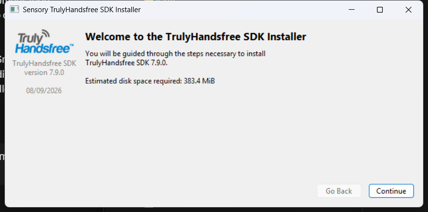
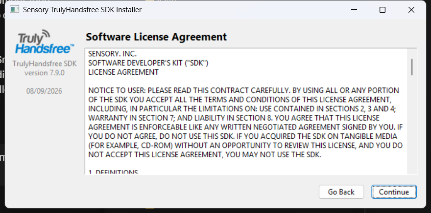
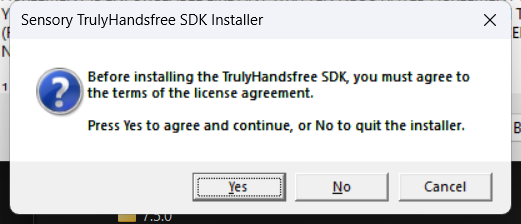
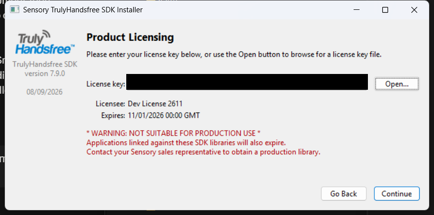
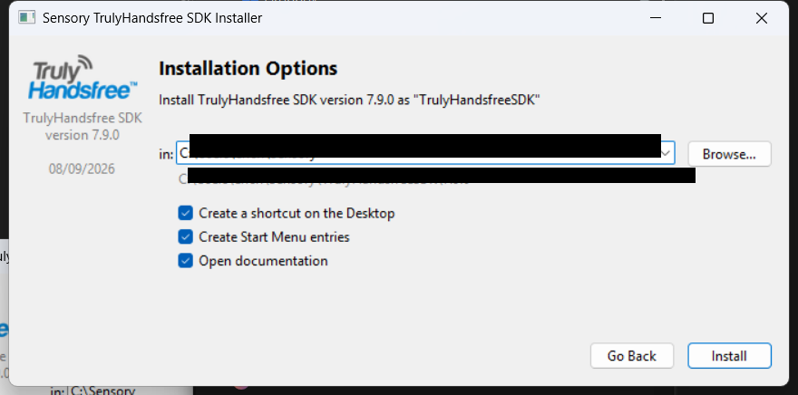
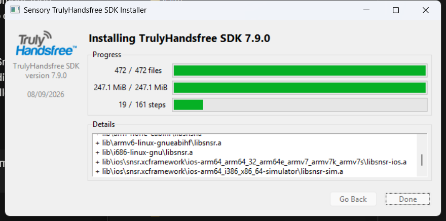
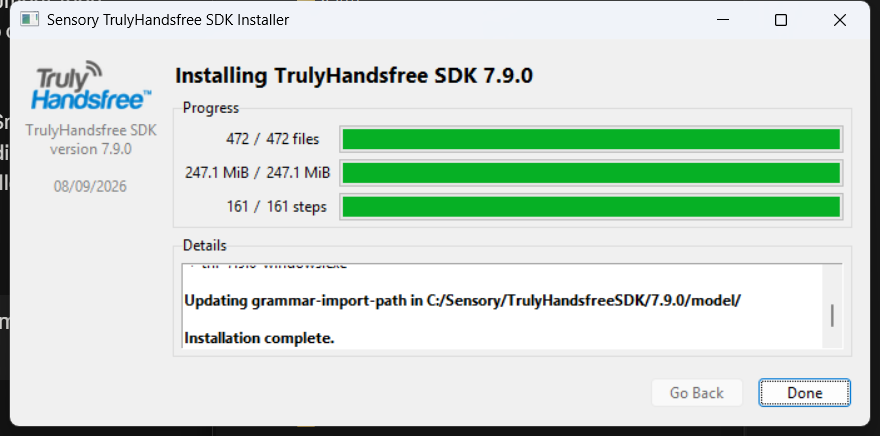

# Getting Started with Sensory THF and TNL Lite/STT SDKs

**Product:** TrulyHandsfree (THF) — wake words and voice commands; TrulyNatural Lite / TNL STT — speech-to-text (LVCSR)
**Models:** Any THF/TNL wake word (`spot-*.snsr`), command, or STT (`stt-*.snsr`) model shipped with your SDK download
**Version:** THF 5.x+ / TNL 7.8.0+ (7.9.0 recommended — see [1.6](#16-a-note-on-terminology-tnl-lite-tnl-stt-and-the-79-grammar-blur))
**Document Version:** 1.0.0
**Audience:** Developers new to Sensory's SDKs — hackathon participants, evaluation/trial licensees, and anyone doing a first integration
**Status:** Released under NDA — Do not distribute

*Copyright © 2026 Sensory Inc. All rights reserved. This document is confidential and proprietary to Sensory Inc. It may not be reproduced, distributed, or disclosed to any third party without prior written permission from Sensory Inc.*

---

## Table of Contents

1. [Overview](#1-overview)
   - [1.1 What Sensory Provides](#11-what-sensory-provides)
   - [1.2 Mapping Capabilities to SDKs](#12-mapping-capabilities-to-sdks)
   - [1.3 Wake Words and Voice Commands (THF)](#13-wake-words-and-voice-commands-thf)
   - [1.4 Speech-to-Text / LVCSR (TNL Lite / TNL STT)](#14-speech-to-text--lvcsr-tnl-lite--tnl-stt)
   - [1.5 Voice Biometrics (Enrolled Models)](#15-voice-biometrics-enrolled-models)
   - [1.6 A Note on Terminology: TNL Lite, TNL STT, and the 7.9 Grammar Blur](#16-a-note-on-terminology-tnl-lite-tnl-stt-and-the-79-grammar-blur)
2. [Before You Start](#2-before-you-start)
   - [2.1 What You Should Already Have](#21-what-you-should-already-have)
   - [2.2 Supported Platforms](#22-supported-platforms)
3. [Installing the SDK and Activating Your License](#3-installing-the-sdk-and-activating-your-license)
   - [3.1 Installing via the GUI Installer](#31-installing-via-the-gui-installer)
   - [3.2 Alternative: Command-Line Install](#32-alternative-command-line-install)
   - [3.3 Verifying the Install](#33-verifying-the-install)
   - [3.4 License Notes](#34-license-notes)
4. [Getting Started with the CLI Tools](#4-getting-started-with-the-cli-tools)
   - [4.1 The snsr-eval Tool](#41-the-snsr-eval-tool)
   - [4.2 Wake Word Detection](#42-wake-word-detection)
   - [4.3 Wake Word → Voice Command](#43-wake-word--voice-command)
   - [4.4 General-Domain STT, Gated by VAD Alone](#44-general-domain-stt-gated-by-vad-alone)
   - [4.5 Automotive-Domain STT, Gated by a Wake Word](#45-automotive-domain-stt-gated-by-a-wake-word)
   - [4.6 Speech-to-Text with a Custom Grammar](#46-speech-to-text-with-a-custom-grammar)
   - [4.7 NLU Intents and Open-Ended Dictation in a Grammar](#47-nlu-intents-and-open-ended-dictation-in-a-grammar)
5. [Finding Your Way Around the SDK](#5-finding-your-way-around-the-sdk)
   - [5.1 Directory Layout](#51-directory-layout)
   - [5.2 Sample Applications by Capability](#52-sample-applications-by-capability)
   - [5.3 Building for iOS and Android](#53-building-for-ios-and-android)
6. [Use Cases and Inspiration](#6-use-cases-and-inspiration)
   - [6.1 Built-In Domain Models](#61-built-in-domain-models)
   - [6.2 Building for a New Domain: Writing a Grammar](#62-building-for-a-new-domain-writing-a-grammar)
   - [6.3 Combining Capabilities into a Pipeline](#63-combining-capabilities-into-a-pipeline)
   - [6.4 Project Ideas](#64-project-ideas)
     - [6.4.1 Pre-Written Grammar: Hotel Concierge / Room Service](#641-pre-written-grammar-hotel-concierge--room-service)
     - [6.4.2 Pre-Written Grammar: Name Dialer](#642-pre-written-grammar-name-dialer)
7. [Where to Get Help](#7-where-to-get-help)
   - [7.1 Documentation Portal](#71-documentation-portal)
   - [7.2 The Other Guides in This Repo](#72-the-other-guides-in-this-repo)
   - [7.3 A Note on Support](#73-a-note-on-support)
8. [Common Pitfalls](#8-common-pitfalls)
9. [Quick Reference](#9-quick-reference)
10. [References](#10-references)

---

## 1. Overview

### 1.1 What Sensory Provides

Sensory's SDKs let an application listen for a wake word, recognize a spoken command or free-form utterance, and — optionally — confirm *who* is speaking, entirely on-device. No audio has to leave the device to do any of this: recognition, transcription, and biometric matching all run locally against a compiled model file (`.snsr`), which is what makes these SDKs suitable for always-listening, privacy-sensitive, and offline use cases.

This guide is a starting point for a first integration, whatever you're building it for — a project, a proof of concept, or your own exploration of what's possible. It orients you around the SDK package, shows you the command line tools, and points you at the right sample code and documentation for what you're trying to build.

### 1.2 Mapping Capabilities to SDKs

If you've seen Sensory's SDKs described as covering "wake words, speech-to-text, voice commands, and biometrics," those four capabilities come from **two** underlying product families, not four separate SDKs:

| Capability | Comes From | Notes |
|---|---|---|
| Wake words | **THF** (TrulyHandsfree) | Always listening |
| Voice biometrics | **THF** (TrulyHandsfree) | An always-listening **enrolled model**, built with THF's enrollment tooling and replaces a fixed (works for anyone) wake word  — see [1.5](#15-voice-biometrics-enrolled-models) |
| Voice commands | **THF** (TrulyHandsfree) | Used for short-listening window commands after the wakeword |
| Limited grammar-based Speech-to-text (LVCSR) | **TNL Lite** (TrulyNatural Lite) | Uses a grammar to describe the vocabulary of what can be recognized. Returns intents |
| General domain Speech-to-text (STT) | **TNL STT** (TrulyNatural Speech-to-Text) | Can recognize any speech "out of the box". Also supports grammars and intents |

Note: THF is a strict subset of TNL Lite, which is itself a strict subset of TNL STT. In other words, with TNL STT you can accee the full suite of Sensory THF/TNL technologies. 

In practice, most projects use THF for "listen for X and react instantly" (a wake word, a small fixed set of commands) and TNL for "transcribe whatever was said" (open-ended dictation, or a large/flexible vocabulary). Biometrics isn't a separate engine — it's what you get when you enroll a wake word or command model on a specific speaker's voice instead of using a pre-trained, speaker-independent one.

### 1.3 Wake Words and Voice Commands (THF)

THF models are **fixed-grammar phrase spotters**: they listen continuously for one or more specific phrases (a wake word like "Voice Genie," or a small fixed command set) and fire a result the instant a match is heard. They're built for always-on, low-latency, low-power listening — the SDK's RTF (real-time factor) requirements for wake words exist specifically because a continuously-running detector has to keep up with live audio without falling behind (see [Benchmarking RTF and Avg/Max Memory Usage §1](benchmarking-rtf-memory.md#1-overview)).

Pre-trained wake word and command models ship in `model/`; you can also train your own custom wake word phrase using **VoiceHub**, Sensory's model-authoring portal, without writing a grammar by hand (see [Creating and Using Enrolled Models §3.3](enrolled-models.md#33-simulated-enrolled-fixed-enrollment-sefw) for one example of a VoiceHub-authored model).

### 1.4 Speech-to-Text / LVCSR (TNL Lite / TNL STT)

TNL STT models transcribe open-ended speech rather than matching a fixed phrase — this is the engine behind dictation and free-form voice input. The SDK ships STT models pre-trained for several **domains** (general-purpose vocabulary plus the domain-specific ones in [6.1](#61-built-in-domain-models)) and in multiple **sizes** (e.g. small/medium/large), trading accuracy against memory and CPU footprint — see the size/domain comparison table in [Benchmarking RTF and Avg/Max Memory Usage §7](benchmarking-rtf-memory.md#7-benchmark-results-across-model-sizes) for concrete numbers.

If you need to know how well an STT model performs on speech representative of your own project (accent, vocabulary, background noise) rather than trusting Sensory's published figures, see [Measuring Word Error Rate (WER) for TrulyNatural STT Models](measuring-stt-wer.md).

### 1.5 Voice Biometrics (Enrolled Models)

Voice biometrics is a layer on top of THF/TNL's core recognition, not a separate SDK: you record a handful of samples from one speaker (**enrollment**) to produce a small, speaker-specific model, then set a verification threshold so a match only fires for that speaker's voice. The full mechanics — enrollment types, the enrollment API, runtime scoring, and the pitfalls to avoid — are covered in [Creating and Using Enrolled Models](enrolled-models.md); that's the guide to read before building anything biometric.

### 1.6 A Note on Terminology: TNL Lite, TNL STT, and the 7.9 Grammar Blur

You may see the STT/LVCSR engine referred to as **TNL Lite** or **TNL STT** depending on where you look — this guide uses the two interchangeably to mean the same thing: TrulyNatural's speech-to-text engine, distinct from THF's fixed-grammar wake word/command engine.

As of **TNL 7.9.0**, the line between "voice command" and "speech-to-text" has blurred: TNL STT models now support grammars directly, so a task that used to require a separate THF command model can often be built as a grammar-constrained STT model instead. If you're on 7.9.0+, don't assume "STT" only means open-ended dictation — check whether a grammar-constrained STT model covers your use case before reaching for a separate THF command model.

---

## 2. Before You Start

### 2.1 What You Should Already Have

This guide assumes you already have, from the SDK delivery email:

- The SDK installer package for your development OS (Windows, Linux, or macOS).
- A license key, valid for a limited time (evaluation and event licenses are commonly time-boxed — e.g. 30 days; check the expiration noted in your delivery email)

If you don't have these yet, they're issued by Sensory as part of the SDK delivery process for your event or evaluation — contact whoever arranged your access (your event organizer or Sensory contact) rather than looking for a public download; the SDK and license aren't distributed through this repository.

### 2.2 Supported Platforms

Two different "platform" questions matter here, and it's easy to conflate them:

- **Where you install the SDK to build and test** — the desktop SDK installs on **Windows, Linux, or macOS**, and includes command-line tools (`bin/`) you can use to try models out without writing any app code yet.
- **Where your finished app will run** — THF/TNL also ship **platform bindings for Python, iOS and Android**, so the same models you test on your desktop can run inside a mobile app. There's no separate "mobile SDK" to install; you link the platform binding for your target OS into your app project and use the same models and API concepts covered in this guide.

If your project targets embedded Linux (a Raspberry Pi, an automotive or IoT dev board), the same desktop Linux SDK covers that too.

---

## 3. Installing the SDK and Activating Your License

### 3.1 Installing via the GUI Installer

The walkthrough below is from the Windows installer (TrulyHandsfree SDK 7.9.0); the macOS and Linux installers follow the same steps with OS-appropriate dialogs.

**1. Welcome screen.** Confirms the SDK version and the disk space required.



**2. Software License Agreement.** Read and scroll through the SDK's license agreement.



**3. Agree to continue.** Confirm acceptance — choosing **No** quits the installer.



**4. Product Licensing.** Paste the license key from your delivery email into the **License key** field, or click **Open...** to load it from a license key file instead. The installer displays the licensee name and expiration date it reads from the key — confirm the expiration date here, since this is your only warning before it becomes relevant mid-project (see [3.4](#34-license-notes)). An evaluation/development key like the one shown also prints a **NOT SUITABLE FOR PRODUCTION USE** warning — expected for a hackathon or trial license, not a sign anything is wrong.



**5. Installation Options.** Choose an install directory (or accept the default, under your user profile) and whether to create a desktop shortcut, Start Menu entries, and open the documentation after install.



**6. Installation progress.** The installer copies SDK files (`bin/`, `model/`, `sample/`, platform libraries for Android/iOS/Linux/etc.) and runs its post-install steps.



**7. Installation complete.** Once every step finishes, **Done** becomes clickable.



### 3.2 Alternative: Command-Line Install

The same installer binary also accepts command-line flags for a silent, unattended install — useful for scripting a setup (e.g. provisioning multiple hackathon machines identically) instead of clicking through the wizard on each one.

**Windows:**

```bash
thf-7.9.0-windows.exe --key <LicenseKey> --no-desktop-link --install-root "C:\Users\<name>\Sensory"
```

**macOS:**

```bash
thf-7.9.0-macos --key <LicenseKey> --no-desktop-link --install-root "~/Sensory"
```

**Linux:**

```bash
thf-7.9.0-linux --key <LicenseKey> --no-desktop-link --install-root "~/Sensory"
```

- `--key` — your license key, in place of pasting it into the GUI's Product Licensing screen ([3.1](#31-installing-via-the-gui-installer) step 4).
- `--no-desktop-link` — skips creating the desktop shortcut shown as a checkbox on the GUI's Installation Options screen ([3.1](#31-installing-via-the-gui-installer) step 5).
- `--install-root` — the base install directory, equivalent to the **in:** field on the same Installation Options screen; the SDK is installed under `<install-root>/TrulyHandsfreeSDK/<version>` either way (see the sub-caption on that screen).

Run the installer binary with `--help` for the full flag list, including any Start Menu/documentation-launch equivalents to the remaining GUI checkboxes.

### 3.3 Verifying the Install

Once installed, open a terminal window and navigate to the root folder to confirm the command-line tools run on your machine — for example:

**Windows:**

```bash
cd C:\Users\<username>\Sensory\TrulyNaturalSDK\7.9.0
.\bin\snsr-eval
```

**Linux or Mac:**

```bash
cd ~/Sensory/TrulyNaturalSDK/7.9.0
./bin/snsr-eval
```

You should see usage/help output rather than a "command not found" error. If it's not found, either add the SDK's `bin/` directory to your `PATH` manually, or re-run the installer and check whether it offered (and you accepted) a "add to PATH" option.

### 3.4 License Notes

- Your license key is tied to a specific expiration date — plan your project timeline around it, and don't wait until the last day of an event to first install.
- Treat your license key like a credential: it's issued to you (or your group) specifically, and re-use or sharing outside the group isn't authorized.
- If your license expires mid-project, contact whoever issued it to you for a renewal — this repo and its guides can't issue or extend licenses.

---

## 4. Getting Started with the CLI Tools

Before writing any application code, it's worth getting comfortable with `snsr-eval` — the same command-line tool used throughout this repo's other guides. It loads any model and runs it against a WAV file (or live audio) with no app code around it, which makes it the fastest way to see what a model actually does. This section walks through one worked example per model type from [Section 1.2](#12-mapping-capabilities-to-sdks): a wake word alone, a wake word feeding a command set, the two STT domain models, and an LVCSR model built from a custom grammar, all using files that ship with every SDK download. Run the commands from your SDK install root, with paths relative to it (`bin/...`, `model/...`, `data/audio/...`).

### 4.1 The snsr-eval Tool

```bash
bin/snsr-eval -t <task.snsr> [options] [wavefile ...]
```

`snsr-eval` loads one `.snsr` task file and runs it against one or more WAV files — or against live audio from the default input device if you don't pass any. A handful of flags cover every example below:

| Flag | Meaning |
|---|---|
| `-t task` | The `.snsr` task file to run (required) |
| `-v` | Increase verbosity (stack for more detail: `-v -v`) |
| `-s setting=value` | Override a task setting for this run |
| `-f setting filename` | Load a file's contents into a task setting |
| `-g setting value` | Load a literal string into a task setting |
| `-q setting` | Query a task setting's current value |

Run `bin/snsr-eval` with no arguments for the complete flag list.

Note: In the following examples, pre-recorded wav file are passed to the recognizer. If you wish to test using your own live voice, simply omit the last argument in snsr-eval. You will need to press Ctrl-C to abort the snsr-eval app otherwise it will continue to recognize indefinitely.

### 4.2 Wake Word Detection

The simplest case — run a standalone wake word model directly, no assembly required:

```bash
bin/snsr-eval -v -t model/spot-voicegenie-enUS-6.6.0-m.snsr data/audio/voice-genie-set-cruise-control.wav
```

```
  2310   2910 (1.0000, 1.0000 cs) voicegenie
```

The two numbers are the detected phrase's start/end time in milliseconds; `1.0000, 1.0000 cs` are the wake word's confidence scores.

### 4.3 Wake Word → Voice Command

Chaining a wake word into a command set means assembling the two into a pipeline first with `snsr-edit`, using a template that defines the topology — here, `tpl-spot-sequential` (listen for a command immediately after the wake word fires):

```bash
bin/snsr-edit -o vg-music.snsr -t model/tpl-spot-sequential-1.6.0.snsr \
    -f 0 model/spot-voicegenie-enUS-6.6.0-m.snsr \
    -f 1 model/spot-music-enUS-1.2.0-m.snsr
```

Then run the assembled pipeline exactly like any other task file:

```bash
bin/snsr-eval -v -v -t vg-music.snsr data/audio/voice-genie-music.wav
```

```
Available vocabulary:
  1: "play_music"
  2: "previous_song"
  3: "stop_music"
  4: "next_song"
  5: "pause_music"
  5265 [^listen-begin]
phrase:
  5175   5865 (1.0000 sv) play_music
  6090 [^listen-end]
```

`^listen-begin`/`^listen-end` mark the command-listening window `tpl-spot-sequential` opens right after the wake word fires; the second `-v` is what prints `spot-music-enUS-1.2.0-m.snsr`'s five-command vocabulary up front.

The following suggestions work best when live audio is used.

Suggestion 1: Adding `-s loop=1` to the command line changes when the listening focus returns to the wake word in slot 0. Instead of immediately returning to slot 0 after a spot in slot 1, it resets the expiration timer, and only a 1.listen-window timeout returns to slot 0.

Suggestion 2: Adding '-s loop=2` to the command line pins the listening focus to slot 1. Use this, for example, if an application needs to gate a command set recognizer with a wake word or an external event such as a push-to-talk button.

### 4.4 General-Domain STT, Gated by VAD Alone

STT models don't need a hand-written grammar — they transcribe open-ended speech directly. This example uses the SDK's default general-domain model (already in `model/` — no download needed), wrapped in `tpl-vad-lvcsr` (VAD → STT, a single-slot template with no wake word slot to fill) so VAD alone decides when speech starts and stops. That's the right shape for open-ended dictation that isn't triggered by a specific phrase — compare this to [4.5](#45-automotive-domain-stt-gated-by-a-wake-word), where a wake word gates the STT instead. This example wraps the STT model and evaluates it all at once in `snsr-eval`, rather than assembling a pipeline file first:

```bash
bin/snsr-eval -vv -t model/tpl-vad-lvcsr-3.18.0.snsr \
    -f 0 model/stt-enUS-general-medium-2.4.5-pnc.snsr \
    -s partial-result-interval=0 \
    data/audio/my-recording.wav
```

```
   315 [^begin]
     0   2955 [^end] VAD speech region.
phrase:
   160   2600 (0.9998) Can you tell me a fun fact about octopuses?
words:
   160    280 (0.9932) Can
   360    400 (0.9863) you
   520    680 (0.9990) tell
   760    880 (0.9985) me
   920    960 (0.9722) a
  1040   1200 (0.9666) fun
  1320   1560 (0.9965) fact
  1640   1880 (0.9982) about
  1960   2600 (0.9669) octopuses?
```

`^begin`/`^end` mark VAD's own detected speech region — there's no `^listen-begin`/`^listen-end` pair like the wake-word example in [4.5](#45-automotive-domain-stt-gated-by-a-wake-word), since there's no spotter opening a listening window in the first place; VAD decides on its own when speech starts and stops.

Adding `-vv` to the command line causes word and phrase results to be output. Each word has its own timestamp and score as well as the entire phrase result. For example, the begin and end timestaps for "octopuses" are 1960 mS and 2600 mS from the start of the recognizer, and the confidence score is 0.9669 (on a 0.0 to 1.0 scale).

`my-recording.wav` isn't part of the SDK either — it's a TTS clip saying that exact sentence, provided at [`data/audio/my-recording.wav`](data/audio/my-recording.wav) in this repo. Copy it into your SDK's `data/audio/` (or record your own open-ended sentence) before running the command above. 

See [Measuring Word Error Rate](measuring-stt-wer.md) for a full test corpus if you need many audio files like this at once rather than one at a time.

### 4.5 Automotive-Domain STT, Gated by a Wake Word

The built-in domain models from [6.1](#61-built-in-domain-models) — like the automotive model here — constrain what they expect to hear, which is what makes them more accurate in-domain than the general-purpose model in [4.4](#44-general-domain-stt-gated-by-vad-alone). This example also gates the STT with the Voice Genie wake word instead of VAD alone, a realistic "listen for a trigger, then transcribe the command" pipeline.

The TNL SDK installs with a default general-domain STT model already in `model/`, but the automotive model isn't one of them — download it first from the SDK's model downloads page, https://doc.sensory.com/tnl/7.9/models/downloads/, and save it into `model/` alongside the models that shipped with the install (see [Measuring Word Error Rate §2.2](measuring-stt-wer.md#22-stt-model) for the same download step in more detail, including where to get it for other SDK versions). Then assemble the Voice Genie wake word and the automotive STT model into a pipeline with `tpl-opt-spot-vad-lvcsr` (wake word → VAD → STT), the same way [4.3](#43-wake-word--voice-command) assembled a wake word into a command set:

```bash
bin/snsr-edit -t model/tpl-opt-spot-vad-lvcsr-1.29.0.snsr \
    -f phrasespot model/spot-voicegenie-enUS-6.6.0-m.snsr \
    -f lvcsr model/stt-enUS-automotive-medium-2.3.5-nlu-pnc.snsr \
    -o model/opt-vg-vad-stt-enUS-automotive-medium-2.3.5-nlu-pnc.snsr
```

```bash
bin/snsr-eval -v -t model/opt-vg-vad-stt-enUS-automotive-medium-2.3.5-nlu-pnc.snsr \
    -s partial-result-interval=0 \
    data/audio/voice-genie-set-cruise-control.wav
```

```
NLU intent: set_cruise_control (0.9968) = set the cruise control to 55 miles per hour
NLU entity:   number (0.9937) = 55
NLU entity:   speed_unit (0.9936) = miles per hour
  3070   5830 (0.9995) Set the cruise control to fifty five miles per hour.
  2910   6120 [^end] VAD speech region.
```

Because the wake word gates the STT here, the transcript picks up only what was said *after* "Voice Genie" — compare this to running the automotive model directly against the same file (no wake word, no assembly), which would transcribe "Voice Genie" as part of the sentence instead of treating it as a trigger. The automotive model still recognized `set_cruise_control` as an NLU intent with `number` and `speed_unit` entities either way — the "STT models also support grammars and intents" behavior from [1.6](#16-a-note-on-terminology-tnl-lite-tnl-stt-and-the-79-grammar-blur), not something you had to build yourself.

### 4.6 Speech-to-Text with a Custom Grammar

STT and LVCST models support grammars, which are text files that describe all of the words and phrases the user can say. In STT grammars are optional, while in LVCSR a grammar is required. The grammar is compiled into the working recognizer via the `grammar-stream` setting (this is the mechanism behind [6.2](#62-building-for-a-new-domain-writing-a-grammar)'s "write your own grammar" path). 

Save this grammar this to `data/grammars/en-US/simple.grm`:

```
###
### Automatically Generated Grammar
###

phrases = hello world | this is a test | what can I say;
grammar = <s> ($phrases) </s>;
```

```bash
bin/snsr-eval -v -v -t model/tpl-vad-lvcsr-3.18.0.snsr \
    -f 0 model/stt-enUS-general-medium-2.4.5-pnc.snsr \
    -f grammar-stream data/grammars/en-US/simple.grm \
    -s partial-result-interval=0 \
    data/audio/voice-genie-hello-world.wav
```

`voice-genie-hello-world.wav` isn't part of the SDK download — it's a short "Voice Genie, hello world" clip provided alongside this guide at [`data/audio/voice-genie-hello-world.wav`](data/audio/voice-genie-hello-world.wav) in this repo. Copy it into your SDK's `data/audio/` before running the command above, or record your own saying "Voice Genie" followed by one of `simple.grm`'s three phrases — Voice Genie is the wake word this SDK actually ships (there's no "hey sensory" model to trigger on).

```
phrase:
   840   1480 (0.0000) Hello world.
```

The leading "Voice Genie" doesn't show up in the transcript even though there's no wake word model in this pipeline at all — `<s>` at the start of the grammar absorbs it as leading extraneous speech, same as it absorbs ordinary silence.

Both `lvcsr-build-*.snsr` and `stt-*.snsr` models accept a `grammar-stream`. You can replace the STT model in the last example with `lvcsr-build-enUS-14.2.0-5MB.snsr` and get the same result. LVCSR models are smaller and require fewer MIPS, but only recognize what a grammar explicitly defines; STT models don't need a grammar at all (see [4.4](#44-general-domain-stt-gated-by-vad-alone)), but accept one when you want to constrain them to a fixed vocabulary anyway.

`snsr-eval` builds the grammar into a working recognizer and runs it in one step here. Use `snsr-edit` with the same `-f grammar-stream` flag instead (`-o demo-grammar.snsr`) if you want to save the compiled result and reuse it without rebuilding on every run — see [Measuring Word Error Rate §3.2](measuring-stt-wer.md#32-extracting-the-stt-model-from-an-assembled-pipeline) for the same build-once-run-many pattern applied to an assembled pipeline model.

### 4.7 NLU Intents and Open-Ended Dictation in a Grammar

A grammar isn't limited to phrases it can fully enumerate — `{slotName ...}` markup tags part of a match as an NLU slot (see [1.4](#14-speech-to-text--lvcsr-tnl-lite--tnl-stt)), and the special `<dictation/>` element hands recognition off to the STT model's open-vocabulary decoder for exactly one slot, one-way, rather than requiring the grammar to spell out every possible word. That combination lets a single grammar capture a fixed command plus an open-ended argument — a name, a search term, anything the grammar itself doesn't need to know in advance.

Save this grammar to `data/grammars/en-US/call.grm`:

```
g = <s> {call_command call} {callee <dictation/>} </s>;
```

`{call_command call}` tags the literal word "call" as its own intent, `call_command`; `{callee <dictation/>}` tags whatever follows as a second intent, `callee`, whose value comes from open-ended dictation instead of the grammar's own vocabulary. Wrap the general STT model with the Voice Genie wake word using the same `tpl-opt-spot-vad-lvcsr` template from [4.5](#45-automotive-domain-stt-gated-by-a-wake-word), this time also supplying the grammar:

```bash
bin/snsr-eval -v -v -t model/tpl-opt-spot-vad-lvcsr-1.29.0.snsr \
    -f phrasespot model/spot-voicegenie-enUS-6.6.0-m.snsr \
    -f lvcsr model/stt-enUS-general-medium-2.4.5-pnc.snsr \
    -f grammar-stream data/grammars/en-US/call.grm \
    -s partial-result-interval=0 \
    data/audio/voice-genie-call.wav
```

`voice-genie-call.wav` isn't part of the SDK download — it's a "Voice Genie, call John Smith" clip provided alongside this guide at [`data/audio/voice-genie-call.wav`](data/audio/voice-genie-call.wav) in this repo. Copy it into your SDK's `data/audio/` before running the command above, or record your own saying "Voice Genie, call" followed by any name.

```
NLU intent: call_command (0.0000) = call
NLU nlu-slot-value.call_command (0.0000) = call
NLU intent: callee (0.0000) = john smith
NLU nlu-slot-value.callee (0.0000) = john smith
phrase:
   880   1760 (0.4719) Call John Smith.
```

`callee` came back as "john smith" even though the grammar never listed a name — that's `<dictation/>` handing that part of the utterance to the STT model's own decoder rather than matching it against fixed vocabulary. Because `call_command` and `callee` are two separate top-level slots here rather than one nested inside the other, each fires as its own NLU intent, unlike the automotive example in [4.5](#45-automotive-domain-stt-gated-by-a-wake-word), where the whole sentence mapped to a single `set_cruise_control` intent with nested entities. The wake word still gates the STT the same way as [4.5](#45-automotive-domain-stt-gated-by-a-wake-word) — the transcript picks up only what followed "Voice Genie."

---

## 5. Finding Your Way Around the SDK

### 5.1 Directory Layout

The SDK installation follows a consistent layout across platforms:

| Directory | Contents |
|---|---|
| `bin/` | Command-line tools (`snsr-eval`, `snsr-edit`, `spot-enroll`, `live-enroll`, etc.) |
| `model/` | Pre-trained wake word, command, and STT models shipped with the SDK |
| `sample/` | Sample applications and reference code, organized by language/platform (e.g. `sample/c/`, `sample/android/`) |
| `data/audio/` | Sample and test audio files |

### 5.2 Sample Applications by Capability

Rather than starting from a blank project, find the sample closest to what you're building and adapt it:

| You want to build... | Start from... |
|---|---|
| A wake-word-triggered app | The wake word portion of `sample/android/snsr-debug` (also demonstrates command and STT modes) — see [Capturing Debug Audio and Data in THF/TNL §5](debug-audio-capture.md#5-capturing-debug-audio-from-an-app) for how it's structured |
| Open-ended transcription | An STT model loaded the same way as the wake word model in the samples above, substituting an `stt-*.snsr` model — see [1.4](#14-speech-to-text--lvcsr-tnl-lite--tnl-stt) |
| Speaker verification / biometrics | `spot-enroll`/`live-enroll` (CLI) or the `live_enroll.py` / `enrollUDT.java` sample code referenced in [Creating and Using Enrolled Models §4.6](enrolled-models.md#46-enrolling-programmatically-via-the-api) |

### 5.3 Building for iOS and Android

Mobile projects use the same models and the same core API concepts as the desktop samples, through THF/TNL's iOS and Android platform bindings — there isn't a separate mobile-only API to learn. `sample/android/snsr-debug` is the most complete reference implementation in the SDK; there's no equivalent bundled iOS sample, but the same wrapping/session pattern applies through the iOS bindings. If you're building an Android or iOS hackathon project, start by reading through that sample even if your target is iOS.

---

## 6. Use Cases and Inspiration

### 6.1 Built-In Domain Models

The SDK ships STT models pre-trained on vocabulary and phrasing for several domains, in addition to a general-purpose domain:

- **Automotive** — climate, navigation, media, and vehicle-control phrasing (this is the domain used throughout [Benchmarking RTF and Avg/Max Memory Usage](benchmarking-rtf-memory.md), and in [4.5](#45-automotive-domain-stt-gated-by-a-wake-word) above)
- **IoT** — device-control phrasing (turning things on/off, setting states/values)
- **Wearables** — phrasing suited to compact, hands-free interactions

If your project fits one of these domains, start there rather than the general-purpose model — a domain model recognizes in-domain phrasing more reliably because it was trained on it.

Note: Unlike the automotive model in [4.5](#45-automotive-domain-stt-gated-by-a-wake-word), the IoT and Wearables domain models aren't available for self-serve download — contact Sensory Tech Support (techsupport@sensoryinc.com) to get them.

### 6.2 Building for a New Domain: Writing a Grammar

If your project's vocabulary doesn't fit the general-purpose or built-in domain models — a custom command set, a niche vocabulary, a made-up product name — you'll need to author your own grammar rather than relying on a pre-trained model. Two starting points:

- **VoiceHub**, Sensory's model-authoring portal, for building custom wake word and grammar-based models without hand-authoring the underlying model format.
- Compiling a grammar directly against a build-capable LVCSR model yourself, as in [4.6](#46-speech-to-text-with-a-custom-grammar), if you need more control than a portal-authored project gives you.

Recall from [1.6](#16-a-note-on-terminology-tnl-lite-tnl-stt-and-the-79-grammar-blur) that on TNL 7.9.0+, a grammar-constrained STT model may cover what used to require a separate THF command model — worth checking before you build two models where one would do.

### 6.3 Combining Capabilities into a Pipeline

The most capable projects usually chain these pieces together into a pipeline, e.g.:

```
Wake Word (fixed or enrolled)  →  Voice Activity Detection  →  STT/Command (TNL or THF)
        "Hey Car"                 (segments the utterance)     "set the temperature to 72 degrees"
```

This is exactly the shape of the reference pipeline in [Benchmarking RTF and Avg/Max Memory Usage §9](benchmarking-rtf-memory.md#9-pipeline-architecture-reference) (Voice Genie wake word → VAD → automotive STT), and the same shape [Creating and Using Enrolled Models](enrolled-models.md) builds on when it adds an enrolled/biometric model into the mix.

### 6.4 Project Ideas

A few starting points if you're short on inspiration, all buildable from the pieces above:

- A wake-word-triggered IoT controller using the IoT domain STT model for device commands.
- A wearable-style hands-free assistant, gated by speaker verification so it only responds to its owner.
- A custom-domain voice assistant for something with its own vocabulary (a game, a niche appliance, campus-specific terminology) — a good fit for the custom grammar path in [6.2](#62-building-for-a-new-domain-writing-a-grammar).
- An automotive-style voice command demo built directly on the pre-trained automotive domain model, extended with your own commands via a grammar.

#### 6.4.1 Pre-Written Grammar: Hotel Concierge / Room Service

A ready-to-use grammar for a hospitality project — hotel room service and front-desk/concierge requests — following the [native grammar syntax](https://doc.sensory.com/tnl/7.9/reference/grammar/). It's built almost entirely from rules in the SDK's bundled `system.grm` library (the same library [4.6](#46-speech-to-text-with-a-custom-grammar)'s `import "system.grm";` pulls in), so quantities, times, and natural ordering phrases ("may I have," "can I get two," etc.) don't need to be hand-written — only the hotel-specific vocabulary does. It's provided as a file at [`data/grammars/en-US/hotel-concierge.grm`](data/grammars/en-US/hotel-concierge.grm) in this repo:

```
###
### Hotel Concierge / Room Service Example Grammar
### Save as: data/grammars/en-US/hotel-concierge.grm
###

import "system.grm";

# Room service food and drink ordering, reusing the system library's
# general-purpose ordering phrases ("may I have", "I'd like", "can I get two", etc.).
pizza = (personal | small | medium | large)? (cheese | pepperoni | sausage | combination)? pizza;
side = (fries | onion? rings | fruit);
burger = (hamburger | cheeseburger);
burger_meal = {burger} [with {side}];
salad = (caesar | green | cobb | shrimp | big)? salad;
breakfast = ((eggs | pancakes | waffles | toast | (orange | apple)? juice | coffee | tea) [and])*;
menu_item = club sandwich | {breakfast} | {salad} | {burger_meal} | {pizza} | bottle of water | ice;
order_room_service = $s.ordering {menu_item};

# Requests for extra amenities (towels, pillows, toiletries, etc.).
amenity = towels | pillows | blankets | toiletries | shampoo | soap | hangers;
request_amenity = [please] ($s.ordering [extra | more] {amenity} | (can | could) [I] (get | have) [extra | more] {amenity}) [please];

# Housekeeping requests.
housekeeping = [please] ((send up? | get me) housekeeping up? | (clean | make up) my room | I need my room cleaned) [please];

# Wake-up calls, reusing the system library's time-expression class.
wake_up_call = [please] (wake [me] [up] at ~s.time [tomorrow] | [please] set a wake up call for ~s.time [tomorrow]) [please];

# Do Not Disturb toggle, reusing the system library's on/off phrasing.
do_not_disturb = [please] $s.on-off do not disturb [sign] | do not disturb;

# Front-desk / concierge questions.
checkout_query = ~s.when-queries checkout | what time (is | do I have to) check out;
amenity_location = pool | gym | fitness center | spa | restaurant | bar | business center | parking | front desk | concierge [desk];
location_query = ~s.location-queries [the] {amenity_location} | ~s.noun-queries [the] {amenity_location};

grammar = <s> ( {order_room_service} | {request_amenity} | {housekeeping} | {wake_up_call} | {do_not_disturb} | {checkout_query} | {location_query} ) </s>;
```

Each top-level `{slot}` becomes its own NLU intent, the same NLU markup from [4.7](#47-nlu-intents-and-open-ended-dictation-in-a-grammar):

| Intent | Example utterance |
|---|---|
| `order_room_service` | "I'd like to have a coffee" |
| `request_amenity` | "can I get extra towels" |
| `housekeeping` | "please send housekeeping" |
| `wake_up_call` | "wake me up at seven thirty a m tomorrow" |
| `do_not_disturb` | "turn on do not disturb" |
| `checkout_query` | "what time is checkout" |
| `location_query` | "where is the pool" |

**The `import` needs the current working directory to contain `system.grm`.** Per the grammar reference, the compiler resolves a bare module name like `"system.grm"` against its own current working directory, not the importing file's directory — so build this grammar from inside the SDK's `data/grammars/en-US/` folder (where `system.grm` already ships), with your own grammar file copied in alongside it, rather than from your SDK install root:

```bash
cd data/grammars/en-US
./bin/snsr-edit -v -t model/tpl-opt-spot-vad-lvcsr-1.29.0.snsr \
    -f phrasespot model/spot-voicegenie-enUS-6.6.0-m.snsr \
    -f lvcsr model/stt-enUS-general-medium-2.4.5-pnc.snsr \
    -f grammar-stream data/grammar/en-US/hotel-concierge.grm \
    -o model/opt-vg-hotel-concierge.snsr
```

Run the compiled result with `snsr-eval` from anywhere, the same way as any other task file:

```bash
bin/snsr-eval -v -t model/opt-vg-hotel-concierge.snsr 
```

Say "Voice genie, I'd like like to have a club sandwich."
```
P  62230  62270 (0.0794) M
P  62230  62270 (0.0547) He
P  63190  63790 (0.2424) I'd like to have
P  63270  63990 (0.5569) I'd like to have a
P  63270  64630 (0.3269) I'd like to have a club sandwich
P  63270  64910 (0.9022) I'd like to have a club sandwich
 62235  65490 [^end] VAD speech region.
NLU intent: order_room_service (0.0000) = I'd like to have a club sandwich
NLU entity:   menu_item (0.0000) = club sandwich
 63270  65030 (0.9007) I'd like to have a club sandwich.
```

Say "Voice genie, where is the pool?"
```
P  98040  98080 (0.0170) M
P  98600  98760 (0.1222) Where
P  98600  99240 (0.5028) Where is the pool
P  98680  99480 (0.9018) Where is the pool
 98040  99960 [^end] VAD speech region.
NLU intent: location_query (0.0000) = where is the pool
NLU entity:   amenity_location (0.0000) = pool
 98680  99520 (0.9032) Where is the pool?
```

#### 6.4.2 Pre-Written Grammar: Name Dialer

A "call a contact" grammar that combines a fixed phrase list with an open-ended fallback: a list of known names is matched directly, but anything else is handed off to `<dictation/>` — the same special symbol from [4.7](#47-nlu-intents-and-open-ended-dictation-in-a-grammar) — so the user can also ask to call someone who isn't on the list. The name list itself isn't hard-coded into the grammar — it's loaded separately from a plain phrase-list file via the `phrases-stream` setting, so an app can swap in a real contact list (e.g. from the phone's address book) without recompiling the grammar. Both files are provided in this repo: [`data/grammars/en-US/name-dialer.grm`](data/grammars/en-US/name-dialer.grm) and [`data/grammars/en-US/known-names.txt`](data/grammars/en-US/known-names.txt):

```
###
### Name Dialer Example Grammar
### Save as: data/grammars/en-US/name-dialer.grm
###

callee = {known_contact ~known_names} | {random_name <dictation/>};
call = call {callee};

grammar = <s> {call} </s>;
```

```
# Known contact names for the name-dialer example grammar.
# Save as: data/grammars/en-US/known-names.txt
home
work
mom and dad
grandma and grandpa
the office
the school
```

`~known_names` (the `~` sigil, not `$`) marks a **class** — a name resolved externally rather than a rule defined in this file. `phrases-stream.<classname>` fills a class like this from a plain phrase list instead of grammar syntax: one phrase per line (or semicolon-separated), UTF-8, `#` for comments — exactly the `known-names.txt` file above. `{call}` is the single top-level NLU intent; `{callee}` — shorthand for `{callee $callee}` — is a nested entity of that intent, and `callee` itself splits into two further nested slots depending on which alternative matched: `{known_contact ~known_names}` when the utterance matches the phrase list, or `{random_name <dictation/>}` when it doesn't. Nested slots report as dotted names, so the NLU output below shows `callee.known_contact` or `callee.random_name` rather than a single flat `callee` value.

Wrap the general STT model with the Voice Genie wake word using `tpl-opt-spot-vad-lvcsr`, the same as [6.4.1](#641-pre-written-grammar-hotel-concierge--room-service) and [4.5](#45-automotive-domain-stt-gated-by-a-wake-word), loading the grammar and the phrase list onto the assembled pipeline:

```bash
bin/snsr-edit -t model/tpl-opt-spot-vad-lvcsr-1.29.0.snsr \
    -f phrasespot model/spot-voicegenie-enUS-6.6.0-m.snsr \
    -f lvcsr model/stt-enUS-general-medium-2.4.5-pnc.snsr \
    -f grammar-stream data/grammars/en-US/name-dialer.grm \
    -f phrases-stream.known_names data/grammars/en-US/known-names.txt \
    -o model/opt-vg-name-dialer.snsr
```

```bash
bin/snsr-eval -v -t model/opt-vg-name-dialer.snsr
```

Say "Voice Genie, call home" (a phrase in `known-names.txt`):

```
NLU intent: call (0.0000) = call home
NLU entity:   callee.known_contact (0.0000) = home
   920   1400 (0.5387) Call home.
   720   1605 [^end] VAD speech region.
```

Say "Voice Genie, call Alexander Fitzgerald" (not on the list, handled by dictation):

```
NLU intent: call (0.0000) = call alexander fitzgerald
NLU entity:   callee.random_name (0.0000) = alexander fitzgerald
   920   2400 (0.7578) Call Alexander Fitzgerald.
   720   2805 [^end] VAD speech region.
```

As with the earlier wake-word examples, "Voice Genie" doesn't appear in the transcript because the wake word gates the STT rather than being part of the recognized sentence.

**The fixed list can still win on a close-sounding name.** A name that sounds enough like an entry in `known-names.txt` can get recognized as that entry instead of falling through to dictation — "Voice Genie, call Marcus Dirk" against this exact grammar came back as "Call work" (`callee.known_contact = work`) at a very low confidence (0.0202) rather than engaging dictation for the actual name spoken. Keep the fixed list short and phonetically distinct from names you expect callers to dictate, and treat a low-confidence result on a known contact as a hint that dictation should have fired instead.

---

## 7. Where to Get Help

### 7.1 Documentation Portal

Full API, tool, and model reference documentation is hosted at **doc.sensory.com**, organized per-product and per-version — for example, the TNL 7.9 docs used throughout this repo's other guides live under `https://doc.sensory.com/tnl/7.9/`. Look for the equivalent THF section on the same portal for your installed THF version. This is the primary reference for API calls, setting keys, and CLI tool flags that this guide doesn't repeat — and it's also mirrored locally inside your SDK install (`documentation/`), if you'd rather work offline.

### 7.2 The Other Guides in This Repo

This guide is deliberately an overview — for anything beyond a first integration, one of these covers it in depth:

| If you need to... | See |
|---|---|
| Enroll a speaker or build biometric security | [Creating and Using Enrolled Models](enrolled-models.md) |
| Measure how accurate an STT model is on your own audio | [Measuring Word Error Rate (WER) for TrulyNatural STT Models](measuring-stt-wer.md) |
| Measure CPU/memory footprint on a target device | [Benchmarking RTF and Avg/Max Memory Usage](benchmarking-rtf-memory.md) |
| Debug a recognition problem by capturing the exact audio a device heard | [How to Save Debug Audio and Data in THF/TNL](debug-audio-capture.md) |

### 7.3 A Note on Support

This guide, the documentation portal, and the samples shipped with the SDK are meant to be self-sufficient — you shouldn't need live engineering support to get from a fresh install to a working demo. If you do hit something none of these cover, that's useful signal for Sensory too; note it down (what you were trying to do, what you expected, what happened) rather than assuming it's you.

---

## 8. Common Pitfalls

- Assuming "biometrics" is a separate SDK to install — it's an enrolled model built with the THF/TNL tooling you already have; see [1.5](#15-voice-biometrics-enrolled-models).
- Building a separate THF command grammar on TNL 7.9.0+ when a grammar-constrained STT model would cover the same use case — see [1.6](#16-a-note-on-terminology-tnl-lite-tnl-stt-and-the-79-grammar-blur).
- Reaching for the general-purpose STT domain when a closer-fitting built-in domain (automotive, IoT, wearables) already exists — see [6.1](#61-built-in-domain-models).
- Assuming every domain STT model ships pre-installed — only a default general-domain model comes with the SDK; other domains (automotive included) are separate downloads from the model downloads page — see [4.5](#45-automotive-domain-stt-gated-by-a-wake-word).
- Running `snsr-edit`/`snsr-eval` against a grammar that has an `import "module.grm";` directive from the wrong working directory and getting a "Cannot find grammar module" build error — a bare import name resolves against the tool's **current working directory**, not the importing grammar file's own directory, so build from inside the folder that contains the imported module (see [6.4.1](#641-pre-written-grammar-hotel-concierge--room-service)).
- Letting your license key expire mid-project — check the expiration in your delivery email up front, per [3.4](#34-license-notes).
- Trusting Sensory's published accuracy figures for your specific use case instead of measuring WER against your own representative audio — see [Measuring Word Error Rate](measuring-stt-wer.md#12-why-measure-it-per-deployment).

---

## 9. Quick Reference

```bash
# 1. Confirm the SDK installed correctly and its tools are on PATH
bin/snsr-eval

# 2. Try the pre-trained models against the sample audio in data/audio/ (Section 4):
bin/snsr-eval -v -t model/spot-voicegenie-enUS-6.6.0-m.snsr data/audio/voice-genie-set-cruise-control.wav
bin/snsr-edit -o vg-automotive.snsr -t model/tpl-opt-spot-vad-lvcsr-1.29.0.snsr -f phrasespot model/spot-voicegenie-enUS-6.6.0-m.snsr -f lvcsr model/stt-enUS-automotive-medium-2.3.5-nlu-pnc.snsr
bin/snsr-eval -v -t vg-automotive.snsr -s partial-result-interval=0 data/audio/voice-genie-set-cruise-control.wav

# 3. Pick your path based on what you're building:
#    - Wake word / fixed command  -> THF, Section 1.3
#    - Open-ended transcription   -> TNL Lite/STT, Section 1.4
#    - Speaker verification       -> enrolled-models.md
#    - Custom vocabulary/domain   -> VoiceHub or a hand-authored grammar, Section 6.2 / Section 4.6
```

---

## 10. References

- Sensory documentation portal: https://doc.sensory.com
- TNL 7.9 Docs (example of the per-product/version doc structure): https://doc.sensory.com/tnl/7.9/
- [Creating and Using Enrolled Models with Sensory TrulyHandsfree/TrulyNatural](enrolled-models.md)
- [Measuring Word Error Rate (WER) for TrulyNatural STT Models](measuring-stt-wer.md)
- [Benchmarking Real-Time Factor (RTF) and Avg/Max Memory Usage](benchmarking-rtf-memory.md)
- [Capturing Debug Audio and Data in THF/TNL](debug-audio-capture.md)
